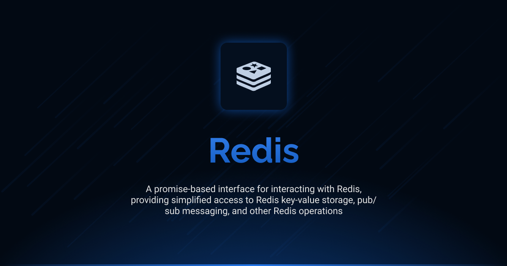

# Interface Redis

<div align="center">
<a href="./LICENSE"></a>
<a href="https://discord.gg/sjK28QHrA7"></a>
<a href="./docs/1.index.md"></a>
</div>

A streamlined interface for Redis operations in TypeScript. Interface Redis provides direct access to Redis client functionality, allowing you to interact with Redis servers for key-value storage, pub/sub messaging, and other Redis operations with a clean, promise-based API.

## Installation

```bash
ajs module imports add redis@beta
```

## Documentation

Detailed documentation is available in the `docs` directory:

- [Index](./docs/1.index.md) - Core functionality and usage examples

## Current Status

This is the development version (`beta`) of the Interface Redis. It is currently in pre-release stage and may undergo changes before the final release. The interface is not considered stable for production use without understanding that breaking changes may occur.

## Versions

| Version | Link                                                                                    | Status                                        |
| ------- | --------------------------------------------------------------------------------------- | --------------------------------------------- |
| beta    | [redis@beta](https://github.com/AntelopeJS/redis/tree/main/output/redis/beta) | Waiting validation from community to go in v1 |
| 1       | _Not yet released_                                                                      | Planned stable release                        |

## License

This project is licensed under the Apache License 2.0 - see the [LICENSE](LICENSE) file for details.
